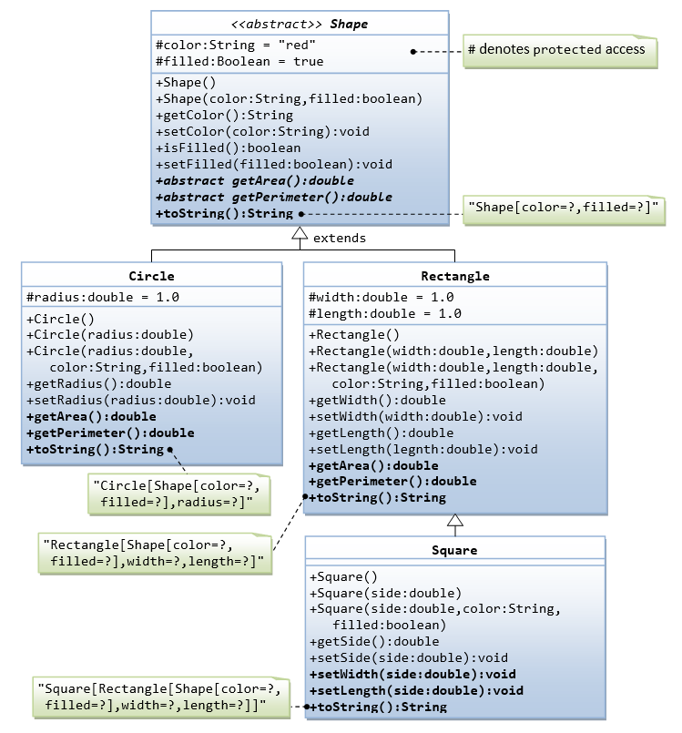

## 1. Bài tập mở đầu
>Thiết kế chương trình theo sơ đồ dưới đây

*Giải thích sơ đồ
- ``<<abstract>>``: ghi chú abstract class
- Dấu thăng (#): protected
- ``entends``: kế thừa, mở rộng từ abstract class, nếu từ interface thì dùng ``implements`` (vì triển khai hàm từ interface).

## 2. Tính chất của OOP
- Kế thừa: class con sẽ kế thừa những gì class cha cho kế thừa (tham khảo [Access Modifiers](../oop1/README.md)). Java chỉ cho phép kế thừa từ 1 class cha, và nhiều interface (C# cũng thế; còn C++, python thì cho phép đa kế thừa - 1 class con kế thừa nhiều class cha).
- Đa hình: cùng 1 tên hàm nhưng có thể có các thức xử lý bên trong khác nhau
    + Đa hình trong compile (overloading): ``Shape()`` không nhận tham số sẽ khác với ``Shape(color, filles)`` có nhận tham số dù là cùng 1 hàm. Truyền các tham số tương ứng sẽ giúp class nhận biết được nên gọi hàm nào. 
    + Đa hình trong runtime (overriding): với annotation ``@Override`` giúp cho hàm ``toString()`` ở class ``Circle`` sẽ khác với ``toString()`` ở class ``Rectangle``. Tùy instance tạo ra từ class nào mà hàm tương ứng được override trong class đó sẽ được gọi